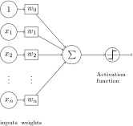

# Everything you need to know About Neural Networks .
In this repository I will try to give you everything you need to know about neural networks, starting with the history and going step-by-step to understanding the various proposed structures, the mathematics behind them, and how to implement them .

<div align="center" >

</div>

## History :


* **1943 :** when Warren McCulloch and Walter Pitts wrote a paper on how neurons might work. They modeled a simple neural network with electrical circuits.
* **1949 :** Donald Hebb furthered the concept of neurons in his book The Regulation of Behavior , He noted that the neural pathways are reinforced each time they are used.
* **1950s** : Nathanial Rochester from the IBM research laboratories led the first effort to simulate a neural network.
* **1956 :** The Dartmouth Summer Research Project on Artificial Intelligence provided a boost to both artificial intelligence and neural networks .
* **1957 :** John von Neumann suggested imitating simple neuron functions by using telegraph relays or vacuum tubes .
* **1958 :** Frank Rosenblatt developed The Perceptron .
* **1960 :** Bernard Widrow and Marcian Hoff developed a single-layer Neural Network they called ADALINE (Adaptive Linear Neuron) .
* **1969 :** Marvin Minsky and Seymour Papert published the Perceptrons (book) , where they point out to the Limitation of The Perceptron Model (The Perceptron can't solve non linear Problems like XOR) .
* **1970 :** backpropagation was first described in Seppo Linnainmaa master's thesis .
* **1974 :** Paul Werbos try for the first time to train a Neural network Using Backpropagation , but this work wasn’t noticed by the community 😞 .
* ...

* Research Stopped to lack of resources and the limitation of The Perceptron 😞 .

* ...

*  **1986 :** Geoffrey Everest Hinton With David Rumelhart and Ronald J. Williams published a paper that popularized the backpropagation algorithm for training multi-layer neural networks (we're back again 😃).
* **1986 :** Recurrent Neural Network Proposed for The First time .
* **1989 :** Yann LeCun Published a paper under the name Backpropagation Applied to Handwritten Zip Code Recognition , where he proposed Convolution Neural Network for the first time .
*  **1997 :** Hochreiter and Schmidhuber invented LSTM (Long short-term memory) .
*  ...
*  **2014 :** Gated recurrent units introduced (GRU) .
by Kyunghyun Cho et al .
* **2014 :** generative adversarial networks (GANs) introduced 
by by Ian Goodfellow and his colleagues .

## The Perceptron :
the perceptron is an algorithm for supervised learning of binary classifiers developed by Frank Rosenblatt in 1958 . A binary classifier is a function which can decide whether or not an input, represented by a vector of numbers, belongs to some specific class.

<div align="center" >

</div>

The Model can be described mathematically as (m is the number of inputs to the perceptron ) :

<div align="center" >

</div>

The Activation function used by The Perceptron Called Heaviside or Step Function , and it can be described as :

<div align="center" >

</div>

The PseudoCode of The Perceptron Algorithm can be described as :

<blockquote>

DataSet :
<div align="center" >

</div>

* Step 1 : Initialize the weights .
* Step 2 : For each example j in our training set D ,  perform the following steps over the input x_j and desired output d_j :
  
    * Calculate the output :
        <div align="center" >
        
        </div>
    * Update the weights Using This Formula :
        <div align="center" >
        
        </div>      
</blockquote>

now let try to implement The Perceptron Algorithm in Python :

```python
import numpy as np
import matplotlib.pyplot as plt
from sklearn.datasets import make_blobs
from sklearn.model_selection import train_test_split
from sklearn.metrics import accuracy_score

class Perceptron : 
    
    def __init__(self,learning_rate = 10e-3 , number_iter = 300):
        self.learning_rate = learning_rate
        self.number_iter   = number_iter
    
    # Function to fit The Data to The Model    
    def fit(self,x,y):
        self.x = x
        self.y = y
    
    # Function to Initialize The Parameters
    def initParameters(self , x):
        w = np.random.randn(1,x.shape[1])         
        return w
    
    # The Activation Function for individuals Input
    def heaviside(self,x):
        return 1 if x>= 0 else 0
    
    # The Activation Function for Array Input
    def heavisideArray(self,x):
        a = [1 if x1>= 0 else 0 for x1 in x[0]]
        return np.array(a)
    
    # Function to train The Model
    def train(self):
        self.w = self.initParameters(self.x)
        for i in range(self.number_iter):
            for x , y in zip(self.x , self.y):
                z = np.dot(self.w , x)
                y_hat = self.heaviside(z)
                self.w += self.learning_rate * (y - y_hat) * x
    
    # Function to predict the Class of a new Sample            
    def predict(self,x):
        z = np.dot(self.w , x)
        a = self.heavisideArray(z)
        return np.array(a)
    
    # Function to display The Result
    def displayModel(self):
        plt.figure()
        plt.scatter(self.x[:,0] , self.x[:,1] , c = self.y , cmap="bwr")
        x1 = np.linspace(-10,10,100)
        x2 = (-self.w[0][0] * x1 - self.w[0][2]) / self.w[0][1]
        plt.plot(x1,x2 , c='g' , lw=3)
        plt.xlabel('X axis')
        plt.ylabel('Y axis')
        plt.title('The Perceptron Algorithm Result')
        

if __name__ == "__main__":
    
    # Creating The Data
    x , y = make_blobs(n_samples=200 , n_features=2 , centers=2 , random_state= 0)
    
    # Add a Column of ones in X
    b = np.ones(x.shape[0])
    b = b.reshape(b.shape[0] , 1)
    x = np.hstack((x , b))
    
    # Splitting the data 
    x_train , x_test , y_train , y_test = train_test_split(x,y,test_size=0.5 , random_state=0)
    
    # Training The Perceptron
    perceptron = Perceptron()
    perceptron.fit(x_train, y_train)
    perceptron.train()
    perceptron.displayModel()
    
    # Evaluation The Model 
    y_hat = perceptron.predict(x_test.T)
    score = accuracy_score(y_test , y_hat)
    print(f'Model score  : {score}')
```

The Perceptron Model gives us This Result :

<div align="center" >

</div>

**The Limitation of The Perceptron :**

The Perceptron can separate classes linearly , In This example we will try implement The Perceptron model to solve this logic gates problems AND , OR and XOR . 


The DataSet for the tree problems looks like this :
<center>

| Input  |       AND   | OR          | XOR      | 
| -------| ----------- | ----------- | -------- |
|  0 , 0 | 0           | 0           |  0       |
|  0 , 1 | 0           | 1           |  1       |
|  1 , 0 | 0           | 1           |  1       |
|  1 , 1 | 1           | 1           |  0       |

</center>

now let's try to implement The Perceptron Algorithm to see if it can solve this tree problems or not .

```python
import numpy as np
from random import choice

# AND Logic circuit 
AND_data = [(np.array([1,1,1]),1),
                 (np.array([1,0,1]),0),
                 (np.array([0,1,1]),0),
                 (np.array([0,0,1]),0)]   

# OR Logic circuit 
OR_data = [(np.array([1,1,1]),1),
                 (np.array([1,0,1]),1),
                 (np.array([0,1,1]),1),
                 (np.array([0,0,1]),0)]

# XOR Logic circuit 
XOR_data = [(np.array([1,1,1]),0),
                 (np.array([1,0,1]),1),
                 (np.array([0,1,1]),1),
                 (np.array([0,0,1]),0)]

def heaviside(x):
   return 1 if x>= 0 else 0

def Perceptron(training_data,circuit):
    w = np.random.rand(3)
    learning_rate = 0.1
    number_iterations = 100        
    
    for i in range(number_iterations):
      x,y = choice(training_data)
      z = x.dot(w)
      y_predicted = heaviside(z)
      w += learning_rate * (y - y_predicted)*x
    
    print(f"Prediction for {circuit} Logic Circuit :  ")
    for x,y in training_data:
      z = x.dot(w)
      y_pred = heaviside(z)
      print(f"x = {x[:2]} , y = {y} , y_pred = {y_pred}")  
    

Perceptron(AND_data, "AND")

Perceptron(OR_data, "OR")

Perceptron(XOR_data, "XOR")
```

The Output :

```text
Prediction for AND Logic Circuit :  
x = [1 1] , y = 1 , y_pred = 1
x = [1 0] , y = 0 , y_pred = 0
x = [0 1] , y = 0 , y_pred = 0
x = [0 0] , y = 0 , y_pred = 0
Prediction for OR Logic Circuit :  
x = [1 1] , y = 1 , y_pred = 1
x = [1 0] , y = 1 , y_pred = 1
x = [0 1] , y = 1 , y_pred = 1
x = [0 0] , y = 0 , y_pred = 0
Prediction for XOR Logic Circuit :  
x = [1 1] , y = 0 , y_pred = 0
x = [1 0] , y = 1 , y_pred = 0
x = [0 1] , y = 1 , y_pred = 0
x = [0 0] , y = 0 , y_pred = 0
```

as you can see in the output The Perceptron Failed in The XOR problem , **but why ?** .

if we visiualize The DataSet for the tree problems we will get this :

<div align="center" >

</div>

as you can see in the figure above , The perceptron can't implement XOR. The reason is because the classes in XOR are not linearly separable. You cannot draw a straight line to separate the points (0,0),(1,1) from the points (0,1),(1,0) , this small problem stopped The Reaserch in this failed for years ... 

